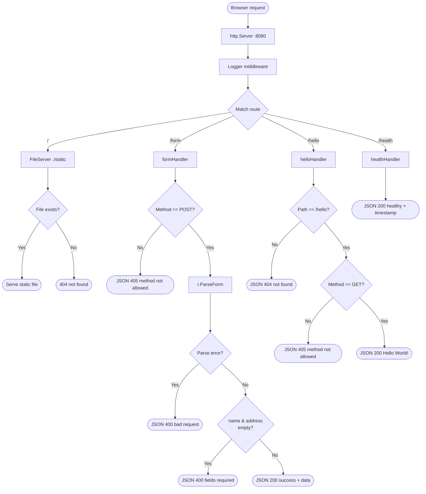

```mermaid
flowchart TD
    A([Browser request]) --> B[http.Server :8080]
    B --> C[Logger middleware]
    C --> D{Match route}

    D -->|"/"| E[FileServer ./static]
    D -->|"/form"| F[formHandler]
    D -->|"/hello"| G[helloHandler]
    D -->|"/health"| H[healthHandler]

    E --> E1{File exists?}
    E1 -->|Yes| E2([Serve static file])
    E1 -->|No| E3([404 not found])

    F --> F1{Method == POST?}
    F1 -->|No| F2([JSON 405 method not allowed])
    F1 -->|Yes| F3[r.ParseForm]
    F3 --> F4{Parse error?}
    F4 -->|Yes| F5([JSON 400 bad request])
    F4 -->|No| F6{name & address\nempty?}
    F6 -->|Yes| F7([JSON 400 fields required])
    F6 -->|No| F8([JSON 200 success + data])

    G --> G1{Path == /hello?}
    G1 -->|No| G2([JSON 404 not found])
    G1 -->|Yes| G3{Method == GET?}
    G3 -->|No| G4([JSON 405 method not allowed])
    G3 -->|Yes| G5([JSON 200 Hello World!])

    H --> H1([JSON 200 healthy + timestamp])
```