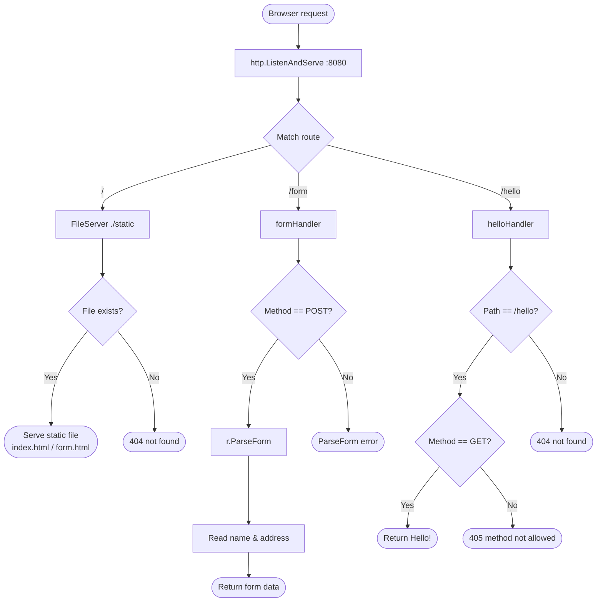

## Flow chart

```mermaid
flowchart TD
    A([Browser request]) --> B[http.ListenAndServe :8080]
    B --> C{Match route}

    C -->|"/"| D[FileServer ./static]
    C -->|"/form"| E[formHandler]
    C -->|"/hello"| F[helloHandler]

    D --> G{File exists?}
    G -->|Yes| H([Serve static file\nindex.html / form.html])
    G -->|No| I([404 not found])

    E --> J{Method == POST?}
    J -->|Yes| K[r.ParseForm]
    K --> L[Read name & address]
    L --> M([Return form data])
    J -->|No| N([ParseForm error])

    F --> O{Path == /hello?}
    O -->|Yes| P{Method == GET?}
    P -->|Yes| Q([Return Hello!])
    P -->|No| R([405 method not allowed])
    O -->|No| S([404 not found])
```